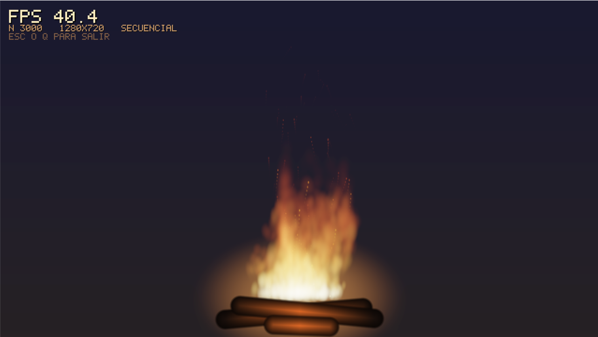

# Fogata — Screensaver secuencial

Screensaver de una fogata de noche: llamas, chispas y humo simulados con un
sistema de particulas sobre un cielo estrellado, con las brasas iluminando el
suelo y el circulo de piedras.

Cada particula tiene temperatura propia, sube por flotabilidad, se enfria y es
empujada por un campo de turbulencia construido con sumas de senos y cosenos.
El color no se pinta directamente: cada particula *suma* luz a un campo RGB en
coma flotante, y solo al final ese campo se comprime a 8 bits pasando por una
paleta de cuerpo negro (rojo -> naranja -> amarillo -> incandescente) y un
mapeo de tonos con bloom.

Esta es la **version secuencial** del Proyecto #1 de Computacion Paralela y
Distribuida. La version paralela con OpenMP se construye a partir de esta.



## Como correrlo desde cero

### Windows (MSYS2)

1. Instalar MSYS2 desde <https://www.msys2.org> y abrir la terminal
   **"MSYS2 MINGW64"**. Es importante que sea esa y no "MSYS2 MSYS" ni
   "UCRT64": son shells distintas, con compiladores y rutas distintas.

2. Instalar las dependencias:

```bash
pacman -S --needed git make mingw-w64-x86_64-gcc mingw-w64-x86_64-SDL2 mingw-w64-x86_64-pkgconf
```

3. Clonar, compilar y ejecutar:

```bash
git clone https://github.com/Ultimate-Truth-Seeker/Proyecto1-CPyD.git
cd Proyecto1-CPyD/fogata
make
./build/fogata
```

Todo esto desde la misma terminal MINGW64. El ejecutable necesita `SDL2.dll`,
que vive en `C:/msys64/mingw64/bin`; esa carpeta ya esta en el PATH de la
terminal MINGW64, y por eso conviene ejecutarlo desde ahi.

### Linux (Ubuntu / Debian)

```bash
sudo apt-get install build-essential libsdl2-dev pkg-config git
git clone https://github.com/Ultimate-Truth-Seeker/Proyecto1-CPyD.git
cd Proyecto1-CPyD/fogata
make
./build/fogata
```

### Otros comandos utiles

```bash
make clean
```

```bash
make run
```

```bash
./build/fogata --help
```

## Problemas frecuentes

| Sintoma | Causa y solucion |
|---|---|
| `SDL2/SDL.h: No such file or directory` | Falta el paquete de SDL2, o se compila desde la shell equivocada. En Windows tiene que ser la terminal **MINGW64**, con `mingw-w64-x86_64-SDL2` instalado. |
| `No se encontro SDL2.dll` al ejecutar | Se lanzo el `.exe` desde el Explorador, `cmd` o Git Bash. Ejecutelo desde la terminal MINGW64, o agregue la carpeta `mingw64/bin` de MSYS2 al PATH del sistema. |
| `Cannot create temporary file in C:\WINDOWS\` al compilar | Se esta usando el `make` de MSYS2 desde Git Bash, que mezcla las rutas de los dos entornos. Compile desde la terminal MINGW64, o use `mingw32-make` con `mingw64/bin` en el PATH. |
| `make: command not found` | Falta el paquete `make` (`pacman -S make`). |
| FPS mas bajos que los de la tabla | Normal con otras aplicaciones pesadas abiertas, o si se quito `-march=native` del Makefile. Baje `-n` para recuperar FPS. |
| Un binario compilado en otra maquina no arranca | `-march=native` genera codigo para el procesador donde se compilo. Recompile en la maquina donde va a ejecutarlo. |

## Parametros

Ningun valor esta fijo en el codigo: todo se lee de la linea de comandos.

| Opcion | Descripcion | Rango | Por defecto |
|---|---|---|---|
| `-n <entero>` | Cantidad de particulas (N) | 1 .. 2000000 | 3000 |
| `-w <entero>` | Ancho de la ventana | 640 .. 7680 | 1280 |
| `-h <entero>` | Alto de la ventana | 480 .. 4320 | 720 |
| `-i <decimal>` | Intensidad del brillo | 0.10 .. 5.00 | 1.00 |
| `-v <decimal>` | Viento lateral | -3.00 .. 3.00 | 0.35 |
| `-s <entero>` | Semilla pseudoaleatoria (0 = reloj) | >= 0 | 0 |
| `--no-vsync` | Desactiva la sincronia vertical | — | vsync activo |
| `--help` | Muestra la ayuda | — | — |

Ejemplos:

```bash
./build/fogata -n 8000 -w 1600 -h 900 -i 1.4
```

```bash
./build/fogata -n 20000 --no-vsync -v -1.2 -s 42
```

> Para medir FPS reales use `--no-vsync`: con vsync activo el contador queda
> topado al refresco del monitor (normalmente 60).

Salir: `ESC` o `Q`.

## Rendimiento medido (version secuencial)

Promedio de mediciones de 1 segundo por corrida, con `--no-vsync` y semilla
fija, sobre un equipo con otras aplicaciones abiertas. Los FPS tambien se
imprimen por consola una vez por segundo, ademas de mostrarse en pantalla.

| N | Resolucion | FPS promedio |
|---|---|---|
| 1 | 1280x720 | ~70 |
| 3000 (por defecto) | 1280x720 | 47.4 |
| 3000 | 640x480 | 108.2 |
| 6000 | 1280x720 | 34.2 |
| 12000 | 1280x720 | 18.2 |

El coste crece de forma practicamente lineal con N, que es justo lo que se
busca de cara a la version paralela: el bucle de acumulacion de particulas es
el que domina el tiempo de frame y es el candidato natural a paralelizar.

### Nota sobre las banderas de compilacion

El Makefile usa `-O3 -ffast-math -march=native`. `-march=native` mide un ~45%
mas de FPS porque deja al compilador vectorizar los bucles del render con las
instrucciones del procesador donde se compila; a cambio, el binario resultante
solo es portable a maquinas con el mismo juego de instrucciones. Si necesita un
binario portable, quite esa bandera del Makefile.

## Programacion defensiva

Todo argumento se valida antes de tocar SDL: se rechazan valores no numericos
(`-n abc`), opciones sin valor (`-n` al final), opciones desconocidas y
cualquier numero fuera de rango. En todos esos casos el programa imprime el
motivo, muestra el modo de uso y termina con codigo de salida 1 sin reservar
memoria ni abrir ventana.
